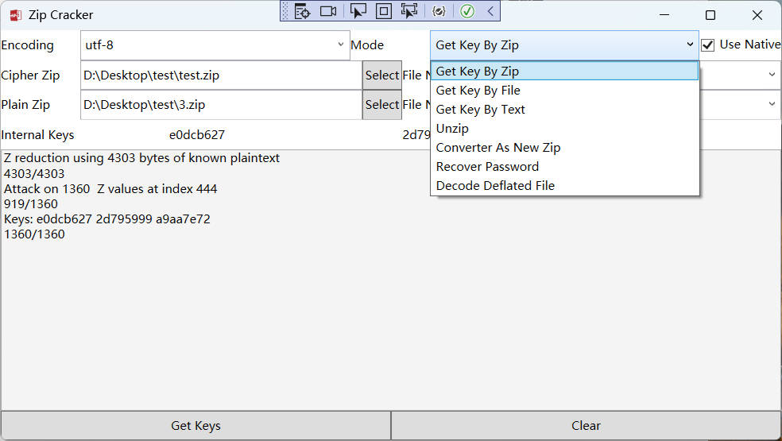

# 介绍

已知加密ZIP中的一个文件，获取其他文件。

本程序参照 [kimci86/bkcrack](https://github.com/kimci86/bkcrack) 进行修改，主要使用 WPF 增加了可视化界面。~~UWP版就不做了~~

## 预览

## 文件介绍

|项目名|介绍|修改的内容|
|:--:|:--:|:--:|
|[Cracker](https://github.com/kimci86/bkcrack)|这是 c++ 控制台版|使用vs2022进行编译改造|
|[Dll/Cracker](https://github.com/kimci86/bkcrack)|这是 c++ 版动态链接库，方便被c# 使用，c++ 与 c# 代码执行效率有很大差距，所以才有这个项目|增加了导出方法|
|[ICSharpCode.SharpZipLib](https://github.com/icsharpcode/SharpZipLib)|这是zip的解压库|因为原版的无法获取压缩文件的数据的开始位置，所以才修改了`ZipFile.LocateEntry` 的访问权限，~~找了几个压缩库都不对外提供文件的开始位置~~|
|src|这就是NET core WPF的界面||
|ZoDream.Shared|使用c# 重写了算法||
|ZoDream.Tests|测试代码|

## 实现功能

1. 基于 `CRC32` 自动配对压缩文件
2. 实现获取 `internal keys`，  ~~同一个密码的不同压缩包Keys不通用？~~
3. 基于 `internal keys` 解压全部文件
4. 支持 Stored, Deflated

## 效率问题

`c++` 版的占用内存大概为 `40M`

`c#` 版的占用内存大概为 `400M` 

## 存在问题

1. 解压某些文件可能有问题，暂时没有解决，其他压缩编码待支持。。。
2. 不支持windows自带ZIP生成的文件
